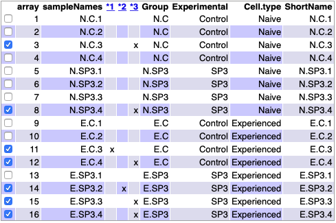
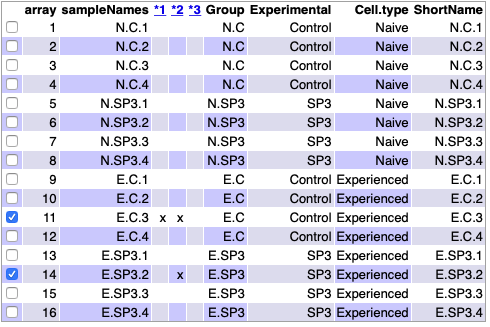

```{r setup, include=FALSE, warning=FALSE}
knitr::opts_chunk$set(echo = TRUE)
library(knitr)
knitr::opts_chunk$set(echo = TRUE, message = FALSE, warning = FALSE, 
                      comment = NA, prompt = TRUE, tidy = FALSE, 
                      fig.width = 5, fig.height = 5, fig_caption = TRUE,
                      cache=FALSE)
library(ggplot2)
library(ggrepel)
library(oligo)
library(Biobase)
library(GEOquery)
library(arrayQualityMetrics)
library(ggplot2)
library(ggrepel)
library(pvca)
library(genefilter)
library(mogene21sttranscriptcluster.db)
library(limma)
library(gplots)
library(ReactomePA)
```

# Abstract
<div class=text-justify>
En el presente trabajo como primera PEC de la asignatura "Análisis de Datos Ómicos". La neumonía adquirida en la comunidad es una enfermedad generalizada con morbilidad y mortalidad significativas. Los macrófagos alveolares son células pulmonares residentes en los tejidos que juegan un papel crucial en la inmunidad innata contra las bacterias que causan neumonía. Se pretende anlaizar cómo los macrófagos alveolares de ratones muestran características adaptativas después de la resolución de la neumonía bacteriana. Los perfiles transcriptómicos revelaron que los macrófagos alveolares de ratones que se recuperaron de la neumonía tenían nuevas actividades de referencia y respuestas alteradas a la infección.
</div>

# Objetivos

<div class=text-justify>
El estudio que he escogido para realizar la presente PEC es el estudio [GSE133975](https://www.ncbi.nlm.nih.gov/geo/query/acc.cgi?acc=GSE133975), pubicado el 17 de abril de 2020 y titulado "Reprogrammed alveolar macrophages after pneumonia recovery".    
  En el estudio usaron microarrays para detallar la expresión génica de macrófagos alveolares de ratones infectados con la bacteria que causa la neumonía denominada *pneumococcus* -aunque en las identificaciones de las muestra contendrá el valor de SP3-, que se dividen en dos grupos (cada uno con su control); ratones "naive" y ratones ya infectados y recuperados pasado un més. A ambos ratones se les tomó una muestra de pulmón para el análisis de macrófagos, que son las células objetivo de este estudio.  
</div>
* Los objetivos del presente trabajo son:
  - Realizar un análisis completo de los datos contenidos de los Arrays publicados en el estudio "Reprogrammed alveolar macrophages after pneumonia recovery".
  - Analizar las comparaciones de perfiles de expresión génica en macrófagos alveolares de ratones infectados con SP3.
  - Comparar los resultados obtenidos en el presente estudio con algunos de los del estudio de referencia.  

# Materiales, Métodos y Resultados

<div class=text-justify>
El organismo de estudio es *Mus musculus* y el diseño del estudio es comparativo, cuyo diseño se basa en 16 Arrays de Affymetrix clasificados en dos factores; experimental y tipo de célula. En el factor experimental tiene dos niveles que codifican a los Arrays control (ratones injectados con suero sólamente) y Arrays con SP3 alos que se les ha inyectado la bacteria.
</div>
<div class=text-justify>
  El presente archivo y sus resultados se hallan disponibles en el repositorio de Github [https://github.com/GABRIELBALLESTER/Ballester_Gabriel_ADO_PEC1.git](https://github.com/GABRIELBALLESTER/Ballester_Gabriel_ADO_PEC1.git).  
Para obtener los datos del estudio se ha preferido realizar un archivo de targets propio para simplificarlo dada la extensión de la lista de phenodata:
</div>
```{r ReadCELfiles, message=FALSE, results='hide', warning=FALSE}
#elist <- getGEO("GSE133975")
celFiles <- list.celfiles("./data", full.names = TRUE)
my.targets <-read.AnnotatedDataFrame(file.path("./data","targets.csv"), 
                                     header = TRUE, row.names = 1, 
                                     sep=";") 
rawData <- read.celfiles(celFiles, phenoData = my.targets)
my.targets@data$ShortName->rownames(pData(rawData))
colnames(rawData) <-rownames(pData(rawData)) 

```

<div class=text-justify>
La plataforma de Affymetrix utilizada para este estudio es [MoGene-2_0-st] Affymetrix Mouse Gene 2.0 ST Array [mogene20st_Mm_ENTREZG_17.1.0](https://www.ncbi.nlm.nih.gov/geo/query/acc.cgi?acc=GPL17791) basada en oligonucleotidos *in situ*. Por ello, cabe esperar que el paquete de anotaciones de bases de datos de bioconductor "mogene21sttranscriptcluster.db" sea el adecuado para las anotaciones de los genes correspondientes.
</div>

## Control de calidad

<div class=text-justify>
Al crear el directorio "arrayQualityMetrics_report_for_rawData" se observa en el archivo index.html (Figura 1) que tan sólo hay una marca en algunos arrays por lo que se puede decidir seguir adelante con todos;
</div>

```{r}
#arrayQualityMetrics(rawData)
```

```{r QCRawDataRes, fig.cap="Tabla resumen de los datos del estudio", echo=FALSE}

```

<div class=text-justify>
Sin embargo, para un control de calidad de los datos brutos más exhaustivo, se procede con el análisis de componentes principales o PCA (Figura 2);
</div>

```{r echo=FALSE}
plotPCA3 <- function (datos, labels, factor, title, scale,colores, size = 1.5, glineas = 0.25) {
  data <- prcomp(t(datos),scale=scale)
  # plot adjustments
  dataDf <- data.frame(data$x)
  Group <- factor
  loads <- round(data$sdev^2/sum(data$sdev^2)*100,1)
  # main plot
  p1 <- ggplot(dataDf,aes(x=PC1, y=PC2)) +
    theme_classic() +
    geom_hline(yintercept = 0, color = "gray70") +
    geom_vline(xintercept = 0, color = "gray70") +
    geom_point(aes(color = Group), alpha = 0.55, size = 3) +
    coord_cartesian(xlim = c(min(data$x[,1])-5,max(data$x[,1])+5)) +
    scale_fill_discrete(name = "Group")
  # avoiding labels superposition
  p1 + geom_text_repel(aes(y = PC2 + 0.25, label = labels),segment.size = 0.25, size = size) + 
    labs(x = c(paste("PC1",loads[1],"%")),y=c(paste("PC2",loads[2],"%"))) +  
    ggtitle(paste("Principal Component Analysis for: ",title,sep=" "))+ 
    theme(plot.title = element_text(hjust = 0.5)) +
    scale_color_manual(values=colores)
  }
```

```{r PCAR, echo=FALSE, fig.cap="Análisis de los Componentes Principales de los Arrays con datos brutos"}
plotPCA3(exprs(rawData), labels = rawData@phenoData@data[["ShortName"]], factor = rawData@phenoData@data[["Group"]], 
         title="Raw data", scale = FALSE, size = 3, 
         colores = c("red", "blue", "green", "yellow"))
```

<div class=text-justify>
Tras ver estos resultados se comprueban que los etiquedados están correctamente, puesto que hay dos Arrays que se separan bastante del resto (E.C.3 y E.SP3.4), ambos pertenecientes al tipo "experienced" pero no del mismo grupo experimental. Estos resultados también se encuentran en la carpeta "arrayQualityMetrics_report_for_rawData". Quizá deberían eliminarse de los posteriores análisis puesto que estos dos Arrays se encuentran a ambos lados del eje que explica el 49.6% de la variabilidad, no obstante se continua teniéndolos en cuenta y efectuando el análisis de boxplot (Figura 3).
</div>

```{r BoxplotRaw, echo=FALSE, fig.cap="Boxplot de los Arrays con datos brutos"}
boxplot(rawData, cex.axis=0.5, las=2,  which="all", 
         col = c(rep("red", 4), rep("blue", 4), rep("green", 4), rep("yellow", 4)),
         main="Distribución de intensidad de los Arrays")
```

<div class=text-justify>
En el Boxplot se observa, una vez más, que E.C.3 y E.SP3.4 son con diferencia los que más variabilidad contienen. Lo siguiente sería, por tanto, ver si esta variabilidad es fruto de un error técnico o si se pueden realizar comparaciones con la normalización de los datos.  
</div>

## Normalización de los datos

<div class=text-justify>
Para efectuar la normalización se empleó el método más indicado para microarrays de Affymetrix, el RMA de Bioconductor que és el método estándar:
</div>

```{r}
eset_rma <- rma(rawData)
```

## Control de calidad de los datos normalizados

<div class=text-justify>
Al efectuar el análisis de control de calidad de los datos una vez normalizados (Figura 4) se oberva que se verifica la disposición de "outlier" el Array E.C.3. Sin embargo, el array E.SP3.4 ya no aparece en la lista. Estos resultados pueden corroborarse con otro Análisis de Componentes Principales para los datos estandarizados (Figura 5).
</div>

```{r}
#arrayQualityMetrics(eset_rma, outdir = file.path("./results", "QCDir.Norm"), force=TRUE)
```

```{r QCNormDatanRes, echo=FALSE, fig.cap="Tabla resumen de los datos del estudio normalizados"}

```


```{r fig:PCANorm, echo=FALSE, message=FALSE, fig.cap="Análisis de Componentes Principales de los datos normalizados"}
plotPCA3(exprs(eset_rma), labels = eset_rma@phenoData@data[["ShortName"]], factor = eset_rma@phenoData@data[["Group"]], 
         title="Datos normalizados", scale = FALSE, size = 3, 
         colores = c("red", "blue", "green", "yellow"))
```

<div class=text-justify>
Con los datos normalizados se observa que el eje que explica el 22.9% de la variabilidad separa a los controles de los casos inoculados con SP3. Además se puede apreciar que el Array E.C.3 sigue estando bastante aislado del resto de sus pares. Por otra parte el eje que explica un 18.2% de la variabilidad de los Arrays también separa, aunque con una menor claridad, los casos "naive" (no expuestos previamente a la bacteria) de los experimentados (ratones inoculados con SP3 y recuperados previamente al experimento). 
</div>

```{r BoxplotNorm, echo=FALSE, message=FALSE, fig.cap="Boxplot de los datos normalizados"}
boxplot(eset_rma, cex.axis=0.5, las=2,  which="all", 
         col = c(rep("red", 4), rep("blue", 4), rep("green", 4), rep("yellow", 4)),
         main="Datos normalizados")
```

<div class=text-justify>
En este análisis se pueden apreciar mucha más similaridad en las intensidades de todos los Arrays (a excepción una vez mas del Array E.C.3). 
</div>

## Filtraje no específico

<div class=text-justify>
El análisis del posible ruido de fondo que puedan tener los dieferentes Arrays del estudio se ha efectuado mediante el análisis de componentes principales de variación (Figura 7) con un threshold de 0.6.
</div>

```{r BatchDetection, echo=FALSE, message=FALSE, warning=FALSE}
pData(eset_rma) <- my.targets@data
pct_threshold <- 0.6
batch.factors <- c("Experimental", "Cell.type")
pvcaObj <- pvcaBatchAssess (eset_rma, batch.factors, pct_threshold)
```

```{r plotPVCA, echo=FALSE, fig.cap="Importancia relativa de los factores Grupo experimental y Tipo celular"}
bp <- barplot(pvcaObj$dat, xlab = "Effects",
  ylab = "proporcion de la varianza ponderada",
  ylim= c(0,1.1),col = c("mediumorchid"), las=2,
  main="PVCA estimado")
axis(1, at = bp, labels = pvcaObj$label, cex.axis = 0.75, las=2)
values = pvcaObj$dat
new_values = round(values , 3)
text(bp,pvcaObj$dat,labels = new_values, pos=3, cex = 0.7)
```

<div class=text-justify>
Como se puede observar, existe una mayor variación no biológica en este caso que es la residual. Esto hace suponer que deberían eliminarse al menos los Arrays que más ruido puedan presentar (por ejemplo el Array  E.C.3). En segundo lugar hemos corroborado que es la variabilidad explicada por el grupo experimental (diferencias entre control y experienced). Y por último, un 16% de la variabilidad sería explicada por el factor de interés en este estudio que no es otro que la diferencia entre las células "naive" y las experimentadas.
</div>

## Identificación de genes diferencialmente expresados

<div class=text-justify>
Tras los resultados del apartado anterior, hay serias sospechas de que la variabilidad total de las muestras pueda enmascarar las diferencias entres los distintos grupos experimentales. Por este motivo se procede a realizar una análisis de la variabilidad de todos los genes para ver qué porcentaje de genes pueden mostrar una variabilidad distinta a la varibilidad genérica de las muestras (Figura 8).
</div>

```{r SDplot, echo=FALSE, fig.cap="Valores de desviaciones estándar de todas las muestras para todos los genes"}
sds <- apply (exprs(eset_rma), 1, sd)
sdsO<- sort(sds)
plot(1:length(sdsO), sdsO, main="Distribución de la variabilidad de los genes",
     sub="Vertical lines represent 90% and 95% percentiles",
     xlab="Gene index (from least to most variable)", ylab="Standard deviation")
abline(v=length(sds)*c(0.9,0.95))
```

<div class=text-justify>
De esta manera se puede apreciar que existe un gran número de genes que presentan una desviación estándar mayor a 1.0, aunque no llega a ser el 5% de los genes.
</div>

### Filtrado de los genes menos variables

<div class=text-justify>
El siguiente paso a realizar es tratar de eliminar todos aquellos genes que puedan provocar una mayor distorsión a la hora de realizar los análisis comparativos, para ello se utilizó el siguiente script:
</div>

```{r Filtering1, results='hide', message=FALSE}
annotation(eset_rma) <- "mogene21sttranscriptcluster.db"
filtered <- nsFilter(eset_rma, 
                     require.entrez = TRUE, remove.dupEntrez = TRUE,
                     var.filter=TRUE, var.func=IQR, var.cutoff=0.75, 
                     filterByQuantile=TRUE, feature.exclude = "^AFFX")
```

```{r FilterResults1, echo=FALSE, results='hide', echo=FALSE}
names(filtered)
class(filtered$eset)
```

```{r FilterResults2, echo=FALSE}
print(filtered$filter.log)
eset_filtered <-filtered$eset
```

<div class=text-justify>
Con lo que, con esta función se han filtrado los genes, eliminando un total de 16710  lo cual es bastante considerable y de suponer teniendo en cuenta los análisis previos. Los archivos resultantes de este análisis se guardaron en archivos .csv del siguiente modo;
</div>

```{r SaveData1, results='hide', message=FALSE}
write.csv(exprs(eset_rma), file="./results/normalized.Data.csv")
write.csv(exprs(eset_filtered), file="./results/normalized.Filtered.Data.csv")
save(eset_rma, eset_filtered, file="./results/normalized.Data.Rda")
```

## Matriz de diseño

<div class=text-justify>
En el presente estudio se pretende una comparación de los macrófagos *naive* de los macrófagos experimentados. Admás, cada grupo experimental cuenta con su control, por lo que la matriz de diseño elaborada es la siguiente: 
</div>

```{r LoadSavedData, echo=FALSE}
if (!exists("eset_filtered")) load (file="./results/normalized.Data.Rda")
```

```{r DesignMatrix, message=FALSE, echo=FALSE}
designMat<- model.matrix(~0+Group, pData(eset_filtered))
colnames(designMat) <- c("E.C", "E.SP3", "N.C", "N.SP3")
print(designMat)
```

<div class=text-justify>
En este estudio y dado el diseño del mismo, cabría esperar también anañizar el efecto memoria de los macrófagos (llamado aquí MEM) que establecen los macrófagos al experimentar previamente la infección del SP3. No obstante el principal objetivo es examinar qué efecto tiene la infección de SP3 en la expresión de genes de los macrófagos de ambos grupos:
</div>

```{r setContrasts}
cont.matrix <- makeContrasts (Infec.E = E.C-E.SP3,
                              Infec.N = N.C-N.SP3,
                              MEM = (E.C-E.SP3) - (N.C-N.SP3),
                              levels=designMat)
print(cont.matrix)
```


## Identificación de genes diferencialmente expresados

<div class=text-justify>
Con el fin de obtener la identificación de genes diferencialmente expresados, se ha obtenido un listado de los mismos según la matriz de diseño y de contrastes. Para ello se han comprobado las pruebas de significación para cada gen y cada comparación:
</div>

```{r, linearmodelfit, message=FALSE}
fit<-lmFit(eset_filtered, designMat)
fit.main<-contrasts.fit(fit, cont.matrix)
fit.main<-eBayes(fit.main)
class(fit.main)
```

<div class=text-justify>
Y con la función "Toptable" se podrán generar para cada contraste una lista de genes ordenados de mayor a menor diferencia de expresión:  
Para los macrófagos experimentados;
</div>

```{r, topTabs1, echo=FALSE}
topTab_Infec.E <- topTable (fit.main, number=nrow(fit.main), coef="Infec.E", adjust="fdr") 
head(topTab_Infec.E)
```

<div class=text-justify>
Para los macrófagos "naive";
</div>

```{r, topTabs2, echo=FALSE}
topTab_Infec.N <- topTable (fit.main, number=nrow(fit.main), coef="Infec.N", adjust="fdr") 
head(topTab_Infec.N)
```

<div class=text-justify>
Para el contraste a priori de menor interés, la diferencia entre los macrófagos experimentados y "naive", o efecto memoria (MEM);
</div>

```{r, topTabs3, echo=FALSE}
topTab_MEM  <- topTable (fit.main, number=nrow(fit.main), coef="MEM", adjust="fdr") 
head(topTab_MEM)
```

## Anotación de los resultados obtenidos 

<div class=text-justify>
Con el fin de correlacionar las etiquetas de los genes o ID. establecidas por Affimetrix con los *gene symbol* establecidos para la descripción de cada uno de los genes, se realizaron las siguientes instrucciones con el paquete de anotaciones *mogene21sttranscriptcluster.db*:
</div>

```{r GeneAnnotation, message=FALSE, warning=FALSE, echo=FALSE}
annotatedTopTable <- function(topTab, anotPackage)
{
  topTab <- cbind(PROBEID=rownames(topTab), topTab)
  myProbes <- rownames(topTab)
  thePackage <- eval(parse(text = anotPackage))
  geneAnots <- select(thePackage, myProbes, c("SYMBOL", "ENTREZID", "GENENAME"))
  annotatedTopTab<- merge(x=geneAnots, y=topTab, by.x="PROBEID", by.y="PROBEID")
return(annotatedTopTab)
}
```

```{r annotateTopTables}
topAnnotated_Infec.E <- annotatedTopTable(topTab_Infec.E,
anotPackage="mogene21sttranscriptcluster.db")
topAnnotated_Infec.N <- annotatedTopTable(topTab_Infec.N,
anotPackage="mogene21sttranscriptcluster.db")
topAnnotated_MEM <- annotatedTopTable(topTab_MEM,
anotPackage="mogene21sttranscriptcluster.db")
write.csv(topAnnotated_Infec.E, file="./results/topAnnotated_Infec.E.csv")
write.csv(topAnnotated_Infec.N, file="./results/topAnnotated_Infec.N.csv")
write.csv(topAnnotated_MEM, file="./results/topAnnotated_MEM.csv")
show(head(topAnnotated_Infec.N[1:5,1:4]))
```

<div class=text-justify>
Y con el fin de visualizar los datos comparados de una manera más simple se diseñó un gráfico volcanoPlot (Figura 9) a modo de ejemplo de las diferencias de memoria entre los macrófagos infectados:
</div>

```{r volcanoPlot, echo=FALSE, fig.cap="VolcanoPlot de las comparaciones entre macrófagos naive y experimentados. Los nombres de los 10 genes que se hallan en las primeras posiciones de la Toptable se resaltan en azul"}
library(mogene21sttranscriptcluster.db)
geneSymbols <- select(mogene21sttranscriptcluster.db, rownames(fit.main), c("SYMBOL"))
SYMBOLS<- geneSymbols$SYMBOL
volcanoplot(fit.main, coef=3, highlight=10, names=SYMBOLS, 
            main=paste("Differentially expressed genes", colnames(cont.matrix)[3], sep="\n"))
  abline(v=c(-1,1))
```

<div class=text-justify>
Estas diferencias encontradas en el volcanoPlot no son determinantes en este estudio, puesto que se centra en las expresiones de los macrófagos *naive* y experimentados principalmente.
</div>

## Comparación entre distintas comparaciones

<div class=text-justify>
En el estudio resulta ser interesante saber qué genes se han seleccionado en cada comparación. A veces, los genes biológicamente relevantes serán aquellos que se seleccionan en uno de ellos pero no en otros. Aunque el principal motivo de este estudio es la comparación entremacrófagos *naive* y experimentados principalmente, puede resultar de interés qué sucede en el resto de comparaciones con el efecto memoria (MEM). Por todo ello, se trató de ver si hay genes que están seleccionados entre las combinaciones de las comparaciones efectuadas del presente estudio.
</div>

```{r decideTests.1, echo=FALSE}
library(limma)
res<-decideTests(fit.main, method="separate", adjust.method="fdr", p.value=0.1, lfc=1)
```

<div class=text-justify>
Para ello se contó con el valor +1 para los sobreexpresados y el valor -1 para los infraexpresados el punto de corte para el análisis se define como "FDR < 0.1" y "logFC > 1" (+1 para valores de t-test $>0$, FDR < punto de corte y -1 para valores de t-test $<0$,  FDR < punto de corte) tomando valores 0 para no diferencias significativas: 
</div>

```{r resumeDecideTests, echo=FALSE}
sum.res.rows<-apply(abs(res),1,sum)
res.selected<-res[sum.res.rows!=0,] 
print(summary(res))
```

<div class=text-justify>
Existe tan sólo un gen sobreexpresado y otro infraexpresado que comparten el efecto memoria con los macrófagos experimentados, esto es muy informativo y llama bastante la atención. Otra manera más simplificada y visual de representar esta información sería mediante un Diagrama de Venn (Figura 10):
</div>

```{r, vennDiagram, echo=FALSE, fig.cap="Genes en común visualizados en un Diagrama de Venn cuya expresión varía significativamente entre los tres contrastes establecidos en el estudio"}
vennDiagram (res.selected[,1:3], cex=0.9)
title("Genes en común entre los tres grupos definidos\n Genes seleccionados mediante FDR < 0.1 y logFC > 1")
```

<div class=text-justify>
En este diagrama se observa el número de genes expresados diferentemente de manera significativa, pero no se ven si están infra o sobreexpresados. Para ver la información con más detalle se procedió a realizar un Heatmap (Figura 11):
</div>

```{r data4Heatmap, echo=FALSE}
probesInHeatmap <- rownames(res.selected)
HMdata <- exprs(eset_filtered)[rownames(exprs(eset_filtered)) %in% probesInHeatmap,]

geneSymbols <- select(mogene21sttranscriptcluster.db, rownames(HMdata), c("SYMBOL"))
SYMBOLS<- geneSymbols$SYMBOL
rownames(HMdata) <- SYMBOLS
write.csv(HMdata, file = file.path("./results/data4Heatmap.csv"))
```

```{r heatmapClustering, echo=FALSE, fig.cap="Heatmap de similaridad para expresión de genes (filas) y muestras (columnas)"}
my_palette <- colorRampPalette(c("blue", "red"))(n = 299)
heatmap.2(HMdata,
          Rowv = TRUE,
          Colv = TRUE,
          dendrogram = "both",
          main = "Genes expresados diferente \n FDR < 0,1, logFC >=1",
          scale = "row",
          col = my_palette,
          sepcolor = "white",
          sepwidth = c(0.05,0.05),
          cexRow = 0.5,
          cexCol = 0.9,
          key = TRUE,
          keysize = 1.5,
          density.info = "histogram",
          ColSideColors = c(rep("red",4),rep("blue",4), rep("green",4), rep("yellow",4)),
          tracecol = NULL,
          srtCol = 30)

```

## Análisis de significación biológica

<div class=text-justify>
Para tratar de vislumbrar qué vía metabólica tienen en común los gens que están diferenciados significativamente entre los grupos analizados, se trabajó con el paquete **ReactomePA** de Bioconductor con un FDR < 0.15 (menos restrictivo) para tratar de asegurar el listado de genes suficientes para poder llegar a coincidencias en vías metabólicas, mostando así los siguientes valores totales de genes para cada grupo (Figura 12):
</div>

```{r selectGenes, echo=FALSE}
listOfTables <- list(Infec.E = topTab_Infec.E, 
                     Infec.N  = topTab_Infec.N, 
                     MEM = topTab_MEM)
listOfSelected <- list()
for (i in 1:length(listOfTables)){
  # select the toptable
  topTab <- listOfTables[[i]]
  # select the genes to be included in the analysis
  whichGenes<-topTab["adj.P.Val"]<0.15
  selectedIDs <- rownames(topTab)[whichGenes]
  # convert the ID to Entrez
  EntrezIDs<- select(mogene21sttranscriptcluster.db, selectedIDs, c("ENTREZID"))
  EntrezIDs <- EntrezIDs$ENTREZID
  listOfSelected[[i]] <- EntrezIDs
  names(listOfSelected)[i] <- names(listOfTables)[i]
}
print(sapply(listOfSelected, length))
```

```{r, echo=FALSE}
mapped_genes2GO <- mappedkeys(org.Mm.egGO)
mapped_genes2KEGG <- mappedkeys(org.Mm.egPATH)
mapped_genes <- union(mapped_genes2GO , mapped_genes2KEGG)
```


```{r BiologicalSig, echo=FALSE}

listOfData <- listOfSelected[1:2]
comparisonsNames <- names(listOfData)
universe <- mapped_genes

for (i in 1:length(listOfData)){
  genesIn <- listOfData[[i]]
  comparison <- comparisonsNames[i]
  enrich.result <- enrichPathway(gene = genesIn,
                                 pvalueCutoff = 0.05,
                                 readable = T,
                                 pAdjustMethod = "BH",
                                 organism = "mouse",
                                 universe = universe)
  
  cat("##################################")
  cat("\nComparison: ", comparison,"\n")
  print(head(enrich.result))

  if (length(rownames(enrich.result@result)) != 0) {
  write.csv(as.data.frame(enrich.result), 
             file =paste0("./results/","ReactomePA.Results.",comparison,".csv"), 
             row.names = FALSE)
  
  pdf(file=paste0("./results/","ReactomePABarplot.",comparison,".pdf"))
    print(barplot(enrich.result, showCategory = 15, font.size = 4, 
            title = paste0("Reactome Pathway Analysis for ", comparison,". Barplot")))
  dev.off()
  
  pdf(file = paste0("./results/","ReactomePAcnetplot.",comparison,".pdf"))
    print(cnetplot(enrich.result, categorySize = "geneNum", schowCategory = 15, 
         vertex.label.cex = 0.75))
  dev.off()
  }
}
```


```{r network, echo=FALSE, fig.cap="Red obtenida del análisis Reactome enrichment de la lista obtenida de las comparaciones de Naive Experienced y MEM"}
  cnetplot(enrich.result, categorySize = "geneNum", schowCategory = 15, 
         vertex.label.cex = 0.75)
```


```{r tableReacto, echo=FALSE}
Tab.react <- read.csv2(file.path("./results/ReactomePA.Results.Infec.E.csv"), 
                       sep = ",", header = TRUE, row.names = 1)

Tab.react <- Tab.react[1:4, 1:5]
knitr::kable(Tab.react, booktabs = TRUE, caption = "Primeras filas y columnas de los resultados de Reactome utilizando la comparación de Infec.E.csv")
```

<div class=text-justify>
Es interesante que la vía metabólica más relevante en los cambios genéticos sea la vía del metabolismo de los fosfolípidos de membrana seguida de la de cascadas de receptores Toll-like y de la de síntesis de fosfolípidos de la membrana de formación de endosomas, así como la de señalización de Interleukinas. 
</div>

<div class=text-justify>
Por último se creó un archivo con las descripciones y contenidos de todos los archivos generados en este análisis (Tabla2).
</div>

```{r listOfFiles, echo=FALSE}
listOfFiles <- dir("./results/") 
knitr::kable(
  listOfFiles, booktabs = TRUE,
  caption = 'Lista de archivos generados en el análisis',
  col.names="List_of_Files"
)
```

# Discusión

<div class=text-justify>
Los resultados de este análisis en paralelo a los acontecidos en el estudio objeto muestran numerosas similitudes como por ejemplo en la producción de glycoproteínas y aumento de la señalización inmune que concuerdan con la producción de fosfolípidos de membrana (catalogado como R-MMU-1483255 en este análisis).   No obstante, hay numerosas diferencias también que han de ser resaltadas. En el estudio se ha correlacionado el fenotipo con el transcrito y eso le confiere una visión mucho más amplia de lo que se supone que pueda aportar este análisis por sí mismo. Además, es de extrañar que algunos de los genes que más repuntan en el estudio completo (Ccl22, Tnf, Marco..) no figuran en la toptable del presente análisis.  Una supuesta hipótesis de por qué esto está sucediendo es quizá a los distintos protocolos de normalización que podrían haberse dado para analizar el estudio. Otro aspecto muy importante a tener en cuenta es que, tal y como hemos podido ver en la figura 7, exista una enorme variabilidad no contemplada, ya catalogada como residual y que pueda enmascarar estos datos. Esto sería compatible con la gran varibilidad y discordancia observada en el Array E.C.3 o N.C.3 que pudiera ser que se haya eliminado previamente a la realización de los análisis efectuados en el estudio original. En todo caso, en este análisis no se ha eliminado ningún Array, puesto que uno de los objetivos principales de este análisis es comparar los resultados obtenidos en el presente estudio con algunos de los del estudio de referencia.  Por otra parte, un aspecto fundamental que debería haberse tenido en cuenta, es una mayor profundización en los que se ha definido en la matriz de contrastes como el efecto memoria, que no es otra cosa que la diferencia entre los perfiles de expresión de los macrófagos estudiados una vez se haya extraído la variabilidad de sus respectivos controles. En éste análisis, al ser sólamente dos genes que han sido diferencialmente expresados de una manera significativa, no se ha podido profundizar más en este aspecto.
</div>

# Conclusión 

<div class=text-justify>
A modo de conclusiones finales, en este estudio de análisis de Arrays se ha podido:
  - Aprender a realizar un análisis completo de los datos contenidos de los Arrays.
  - Descubrir las diferencias de expresión génica en macrófagos alveolares de ratones infectados con SP3.
  - Hipotetizar que las diferencias entre los resultados obtenidos en el presente estudio con algunos de los del estudio de referencia puedan deberse al distinto manejo de los datos brutos.
</div>
